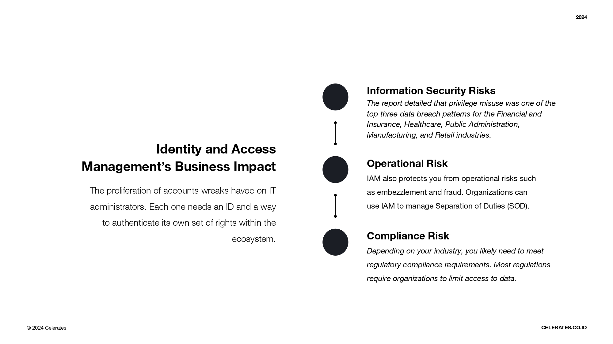

# Identity , Access Management And Identity Federation

## Apa itu Identity dan Access Management 

`Identity dan Access Management` memastikan bahwa pengguna yang tepat memiliki akses yang tepat ke sumber daya TI yang tepat yang tepat, pada waktu yang tepat, untuk alasan yang tepat yang tepat, sehingga mereka dapat melakukan pekerjaan mereka.

### Apa Itu Identity
Secara historis, sebelum digitalisasi dan inisiatif bisnis, identitas hanya terdiri dari pengguna manusia, seperti karyawan atau di tempat kontraktor. Saat ini, identitas dapat berupa manusia atau mesin (perangkat IoT, beban kerja cloud, kode, bot, dll.) yang berinteraksi dengan sistem TI Anda.

### Apa Itu Access
Setelah membuat identitas untuk seseorang, Anda harus menentukan sumber daya apa saja yang dapat diakses oleh identitas tersebut. Untuk misalnya, apakah manusia atau bukan, setiap identitas membutuhkan akses ke sumber daya yang memungkinkan mereka melakukan pekerjaan mereka. Akses tidak akan ada tanpa identitas. Akan tetapi, identitas adalah tidak berguna tanpa menyediakan akses ke sumber daya.

## Identity dan Access Management Di Lingkungan Kerja 
Saat organisasi Anda meningkatkan jumlah sumber daya, Anda juga meningkatkan jumlah aplikasi yang harus Anda beri otorisasi kepada pengguna. Sebagai contoh, misalkan Anda menggunakan drive bersama untuk kolaborasi dan alat pemberdayaan penjualan seperti HighSpot. Dalam hal ini, anggota tim penjualan Anda memerlukan akses ke setidaknya dua layanan yang berbeda. Ketika Anda menambahkan lebih banyak aplikasi Perangkat Lunak sebagai Layanan (SaaS), Anda meningkatkan jumlah alat yang membutuhkan autentikasi.

## Apa Itu Federated Identity  

`Federated Identity` Atau yang dikenal juga sebagai Identitas Federasi adalah metode untuk menghubungkan identitas pengguna di beberapa sistem manajemen identitas yang terpisah.
Ini memungkinkan pengguna untuk berpindah dengan cepat di antara sistem dengan cepat sambil menjaga keamanan.

## Law of Identity (Hukum Identitas)  

- `User control and consent` Pengguna memberikan izin untuk berbagi data, dan mereka setidaknya memiliki suara dalam proses pembagian data.
- `Minimal disclosure` Jumlah terkecil dari informasi pengenal adalah dibagikan, dan disimpan dengan aman dan dihapus dengan cepat.
- `Justification` Hanya mereka yang dapat membuktikan bahwa mereka membutuhkan akses yang bisa mendapatkannya.
- `Directed identity` Perlindungan identitas adalah yang terpenting, dan pengguna harus diberikan pengenal pribadi untuk tujuan itu. Perusahaan-perusahaan tidak dapat bekerja sama untuk membangun pandangan yang lebih permanen tentang seseorang yang bekerja di berbagai platform.
- `Competition` Banyak penyedia identitas yang harus didukung, karena persaingan melahirkan kinerja yang lebih baik.
- `Human integration` Orang yang nyata memiliki tempat dalam prosesnya, mengurangi mengurangi risiko peretasan dari komputer ke komputer.
- `Consistency` Para pengguna memiliki pengalaman yang sederhana dan konsisten di antara platform.

## How Does Federated Authentication Work?  

Manajemen Federated Identity bergantung pada perjanjian yang kuat. Identitas penyedia identitas dan penyedia layanan mengembangkan pemahaman tentang apa atribut (seperti lokasi atau nomor telepon Anda) yang mewakili siapa Anda saat online. Setelah kredensial tersebut diverifikasi, Anda diautentikasi di berbagai platform, Teknologi umum yang digunakan dalam manajemen identitas federasi meliputi :
- Security Assertion Markup Language (SAML)
- OAuth
- OpenID

## Benefits of Federated Access  

Manfaat dari Federated Identity meliputi :
- `Biaya lebih rendah`. Gunakan produk federasi, dan Anda Anda tidak perlu membangun solusi SSO Anda sendiri.
- `Peningkatan efisiensi`. Karyawan tidak perlu membuang waktu untuk masuk ke sistem berulang kali lagi.
- `Data yang terlindungi`. Solusi federasi hadir dengan ekspektasi yang lebih baik dari perlindungan data dan keamanan. Dan karena setiap login adalah titik kerentanan bagi perusahaan, merampingkan proses dapat mengurangi risiko peretasan.

## Misconceptions About Federated Access  
Tidak ada kekurangan yang signifikan dalam menggunakan akses federasi akses, tetapi ada beberapa kesalahpahaman umum tentang itu. Ini termasuk:

- `Less Control`. Solusi manajemen identitas federasi mengikuti seperangkat aturan dan perjanjian tertentu. Beberapa orang takut ini berarti kontrol yang lebih sedikit, tetapi ini tidak terjadi kasusnya. Vendor SSO biasanya menyediakan berbagai
opsi konfigurasi sehingga sistem dapat berperilaku seperti dibutuhkan.
- `Potential security risks`. Tidak ada protokol autentikasi yang sepenuhnya aman, dan beberapa program federasi datang dengan kerentanan yang diketahui. Secara umum, sebuah federasi yang dibuat dengan standar yang umum lebih aman daripada hampir semua program lainnya.