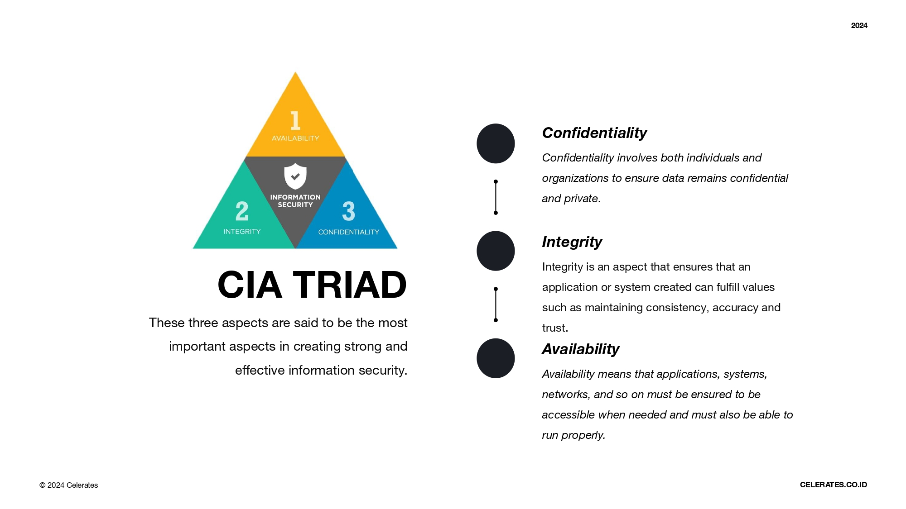

# What Is CIA Triad

`CIA Triad` merupakan model fundamental dalam cyber security yang menjadi landasan utama untuk menjaga keamanan informasi. Model ini terdiri dari tiga aspek utama, yaitu:

- `Confidentiality (Kerahasiaan)` berfokus pada melindungi informasi dari akses yang tidak sah. Hal ini memastikan bahwa hanya individu atau pihak yang memiliki otorisasi yang dapat melihat, membaca, dan menggunakan informasi, Contoh penerapan nya sebagai berikut : 

    - Enkripsi data
    - Kontrol akses
    - Otentikasi multi-faktor

- `Integrity (Integritas)` Integrity atau integritas memastikan bahwa informasi akurat, lengkap, dan tidak dimodifikasi tanpa izin. Hal ini penting untuk menjaga keandalan dan kepercayaan pada informasi, Contoh penerapan nya sebagai berikut

    - Hashing data
    - Backup dan pemulihan data
    - Deteksi dan pencegahan intrusi

- `Availability (Ketersediaan)` Availability atau ketersediaan memastikan bahwa informasi dapat diakses dan digunakan oleh pihak yang berwenang ketika dibutuhkan. Hal ini penting untuk memastikan kelancaran operasi dan bisnis, Contoh penerapan nya sebagai berikut :

    - High availability systems
    - Disaster recovery planning
    - Load balancing

:::warning

#### KEETRKAITAN CIA TRIAD DENGAN KEAMANAN INFORMASI

CIA Triad merupakan landasan utama dalam membangun sistem keamanan informasi yang kuat. Ketiga aspek tersebut saling terkait dan saling mendukung.

- `Confidentiality` membantu melindungi data sensitif dari pencurian dan penyalahgunaan.
- `Integrity` membantu menjaga keandalan dan kepercayaan pada data.
- `Availability` membantu memastikan bahwa data dapat diakses ketika dibutuhkan.

:::
    

:::info

#### KESIMPULAN

CIA Triad adalah model penting dalam cyber security yang membantu organisasi dalam membangun sistem keamanan informasi yang komprehensif. Dengan menerapkan prinsip-prinsip CIA Triad, organisasi dapat melindungi informasi sensitif, menjaga integritas data, dan memastikan ketersediaan data bagi pihak yang berwenang.

:::
