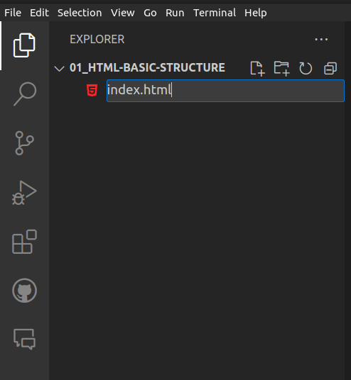
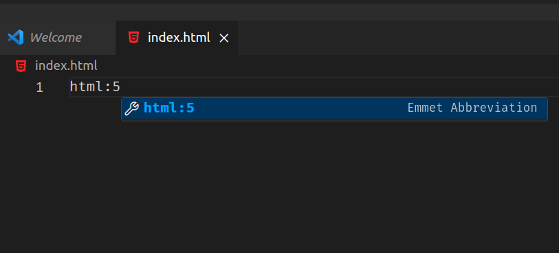

# HTML Basic Structure

Before building the website page we want, of course we need to build the basic structure of the HTML (Hyper Text Markup Language). The basic structure of HTML consists of several important elements that determine the appearance and functionality of the website pages that we create.

## **Create HTML File**

First, create an HTML file first in the text editor that you have. For the file name, please use any name

```bash
index.html
```



## **Create a Basic Structure HTML**

Next, create an HTML file structure like the image below

```bash
html:5
```



When you have finished typing the command html:5, click enter, an HTML structure will appear like the code below

```html title="index.html"
<!DOCTYPE html>
<html lang="en">
  <head>
    <meta charset="UTF-8" />
    <meta name="viewport" content="width=device-width, initial-scale=1.0" />
    <title>Document</title>
  </head>
  <body></body>
</html>
```

## **Explanation a Basic Structure HTML**

```html
<!DOCTYPE html>

Defines the HTML document type used, in the case, HTML 5.
```

```html
<html lang="en"></html>

Marks the starts of the HTML document and states the language used in the page,
In the case, English ("en" is the language code for English).
```

```html
<head></head>

The section contains information about the HTML document, such as meta tags,
page titles, and links to external files such as CSS or JavaScript.
```

```html
<meta charset="UTF-8" />

Defines the character encoding used in the page (UTF-8 is a commonly used
character format).
```

```html
<meta name="viewport" content="width=device-width, initial-scale=1.0" />

Provides instructions to the browser on how to display a page on a web-based
device. These instructions state that the page width follows the device width
and initial zoom the page to level 1.0.
```

```html
<title>Document</title>

Specifies the title of the web page to be displayed in the tab or browser window
title.
```

```html
<body></body>

The section contains all the content that will be displayed on the web page,
such as text, images, links, videos, and more.
```
