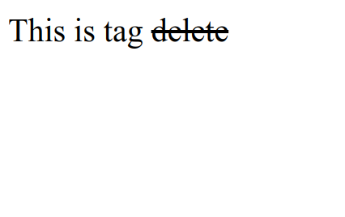

# HTML Delete

HTML delete is used to mark text that has been deleted from a document. Text marked with the `<del>` tag will be displayed with a line inside the text.

The following is an example of using delete tag in HTML :

```html title="index.html"
<p>This is tag <del>delete</del></p>
```

The following are the results of using delete tag in HTML when run in a web browser


