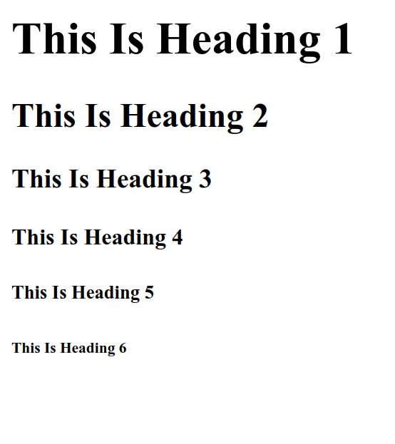

# HTML Headings

HTML Headings are used to create titles or subtitles on web pages. Headings have six levels, starting from `<h1>` as the highest level to `<h6>` as the lowest level.

The following is an example of using headings elements in HTML from `<h1>` to `<h6>` :

```html title="index.html"
<h1>This Is Heading 1</h1>
<h2>This Is Heading 2</h2>
<h3>This Is Heading 3</h3>
<h4>This Is Heading 4</h4>
<h5>This Is Heading 5</h5>
<h6>This Is Heading 6</h6>
```

The following are the results of using headings in HTML when run in a web browser


