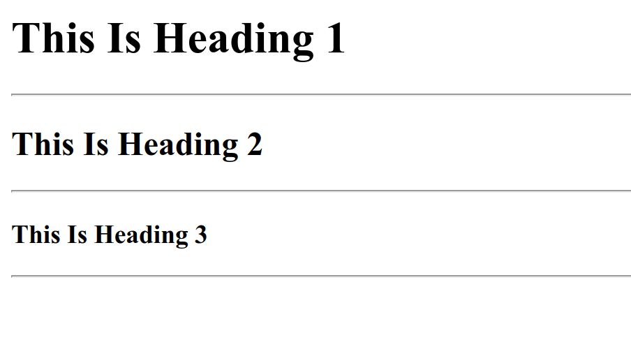

# HTML Horizontal Rules

HTML Horizontal Rules are horizontal line elements that separate content in a web page. Its function is to provide visual separation between sections, divide content simply, use the `<hr />` tag, add a clear structure with horizontal lines.

The following is an example of using horizontal rules elements in HTML :

```html title="index.html"
<h1>This Is Heading 1</h1>
<hr />

<h2>This Is Heading 2</h2>
<hr />

<h3>This Is Heading 3</h3>
<hr />
```

The following are the results of using horizontal rules in HTML when run in a web browser


