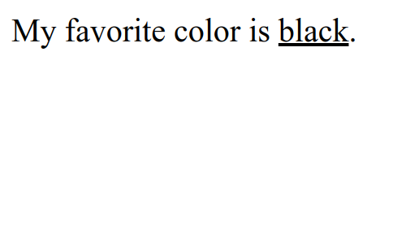

# HTML Insert

HTML insert is used to mark text that has been added to a document. By default, text marked with the `<ins>` tag is underlined. The `<ins>` tag can be used to mark changes or corrections to a document, such as a change in price or date.

The following is an example of using insert tag in HTML :

```html title="index.html"
<p>My favorite color is <ins>black</ins>.</p>
```

The following are the results of using insert tag in HTML when run in a web browser


