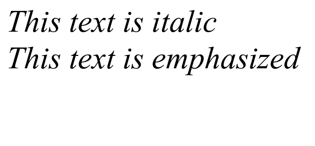

# HTML Italic & Emphasize

HTML `<i>` (italic) and `<em>` (emphasized) are used to create italic text. However the tag `<i>` only functions to make the text italic, while the `<em>` tag has an additional function, namely to emphasize the text.

The following is an example of tag italic and tag emphasized in HTML :

```html title="index.html"
<i>This text is italic</i>

<br />

<em>This text is emphasized</em>
```

The following are the results of using italic and emphasized tag in HTML when run in a web browser


