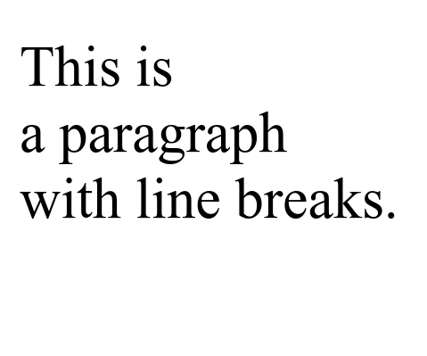

# HTML Line Breaks

HTML Line Breaks are used to separate text content into separate lines in a web page. With the `<br />` tag, this element allows writing text sequentially without creating a new paragraph, providing vertical spacing between lines without additional spaces.

The following is an example of using line breaks elements in HTML :

```html title="index.html"
<p>This is<br />a paragraph<br />with line breaks.</p>
```

The following are the results of using line breaks in HTML when run in a web browser


