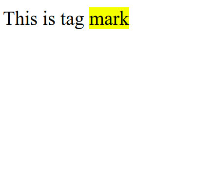

# HTML Mark

HTML marks are used to highlight text in web documents. With this attribute, the text is given visual emphasis, often on a yellow background. This allows users to easily identify or highlight important information while reading a web page. HTML mark use the `<mark>` tag.

The following is an example of using mark tag in HTML :

```html title="index.html"
<p>This is tag <mark>mark</mark></p>
```

The following are the results of using mark tag in HTML when run in a web browser


