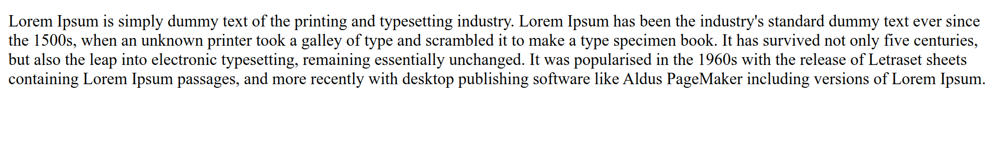

# HTML Paragraphs

HTML paragraphs are a basic element in creating web pages. With the `<p>` tag, this element is used to display the main text or content in a structured paragraph. Its use allows clear separation and organization of text, making it easier for readers to understand the information.

The following is an example of using paragraphs elements in HTML :

```html title="index.html"
<p>
  Lorem Ipsum is simply dummy text of the printing and typesetting industry.
  Lorem Ipsum has been the industry's standard dummy text ever since the 1500s,
  when an unknown printer took a galley of type and scrambled it to make a type
  specimen book. It has survived not only five centuries, but also the leap into
  electronic typesetting, remaining essentially unchanged. It was popularised in
  the 1960s with the release of Letraset sheets containing Lorem Ipsum passages,
  and more recently with desktop publishing software like Aldus PageMaker
  including versions of Lorem Ipsum.
</p>
```

The following are the results of using paragraphs in HTML when run in a web browser


