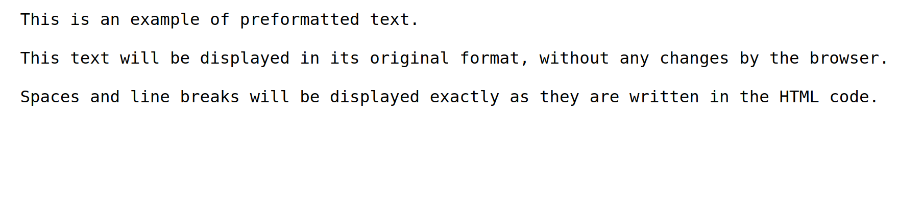

# HTML Preformatted Text

HTML Preformatted Text is used to display text in its original format, without changes by the browser. The text in the `<pre></pre>` tag will be displayed in monospaced font, and the spaces and newlines will be displayed exactly as they are written in the HTML code.

The following is an example of using preformatted text elements in HTML :

```html title="index.html"
<pre>
This is an example of preformatted text.

This text will be displayed in its original format, without any changes by the browser.

Spaces and line breaks will be displayed exactly as they are written in the HTML code.
</pre>
```

The following are the results of using preformatted text in HTML when run in a web browser


