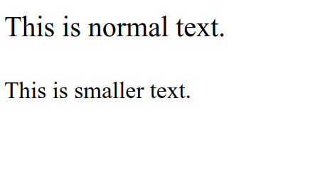

# HTML Small

HTML small is used to display text with a size that is smaller than normal text. This tag is usually used to display additional text, such as copyright or information. HTML small uses the `<small>` tag.

The following is an example of using small tag in HTML :

```html title="index.html"
<p>This is normal text.</p>
<small>This is smaller text.</small>
```

The following are the results of using small tag in HTML when run in a web browser


