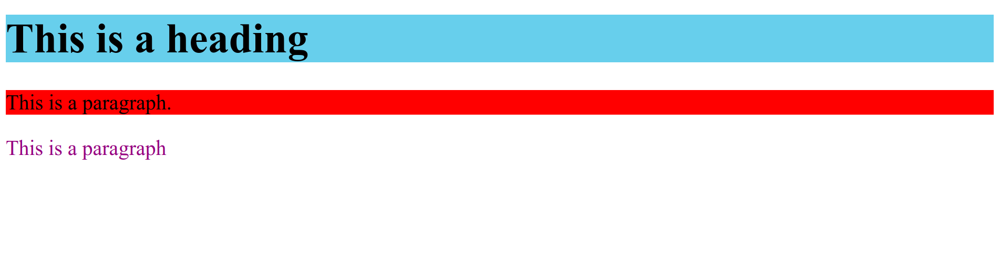

# HTML Styles

HTML `style` is an attribute contained in HTML and is used to control the appearance of HTML elements. With HTML styles, we can change the size, font, color and other elements of HTML elements. HTML styles can be used to create more attractive and informative web pages.

The following is an example of using style attribute in HTML :

```html title="index.html"
<h1 style="background-color: skyblue">This is a heading</h1>
<p style="background-color: red">This is a paragraph.</p>
<p style="color: purple">This is a paragraph</p>
```

The following are the results of using style in HTML when run in a web browser


