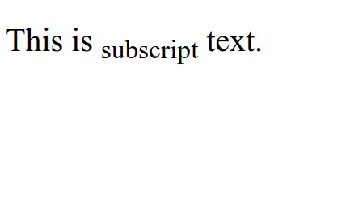

# HTML Subscript

HTML Subscript is used to display text subscript, that is, text written below the normal text baseline. Subscript text is usually used to write scientific notation, chemical formulas, or abbreviations. subscript HTML uses the tag `<sub>` .

The following is an example of using subscript tag in HTML from :

```html title="index.html"
<p>This is <sub>Subscript</sub> text.</p>
```

The following are the results of using subscript tag in HTML when run in a web browser


