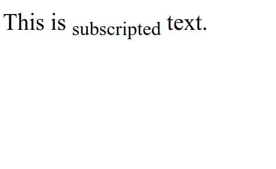

# HTML Subscripted

HTML Subscripted is used to display text subscriptly, that is, text written below the normal text baseline. Subscript text is usually used to write scientific notation, chemical formulas, or abbreviations. Subscripted HTML uses the `<sub>` tag.

The following is an example of using subscripted tag in HTML from :

```html title="index.html"
<p>This is <sub>subscripted</sub> text.</p>
```

The following are the results of using subscripted tag in HTML when run in a web browser


