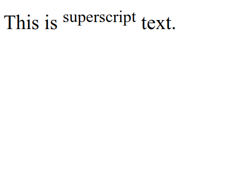

# HTML Superscript

HTML Superscript is used to display text in a higher position than normal text. Superscript text is usually used to display numbers or symbols that need to be displayed above normal text, such as year numbers, ranks, or chemical symbols. Superscript HTML uses the tag `<sup>`.

The following is an example of using superscript tag in HTML :

```html title="index.html"
<p>This is <sup>superscript</sup> text.</p>
```

The following are the results of using superscript tag in HTML when run in a web browser


